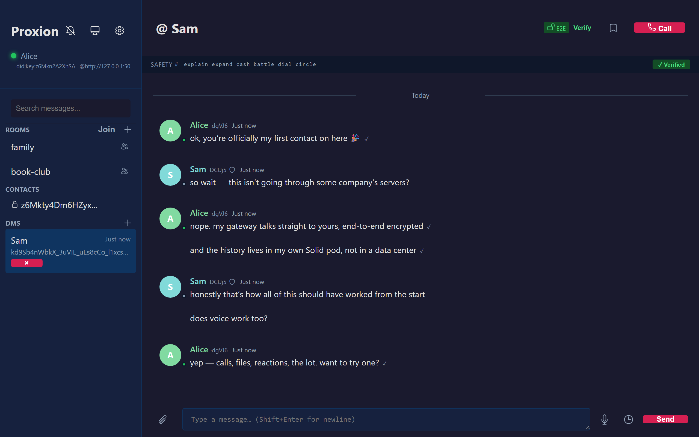
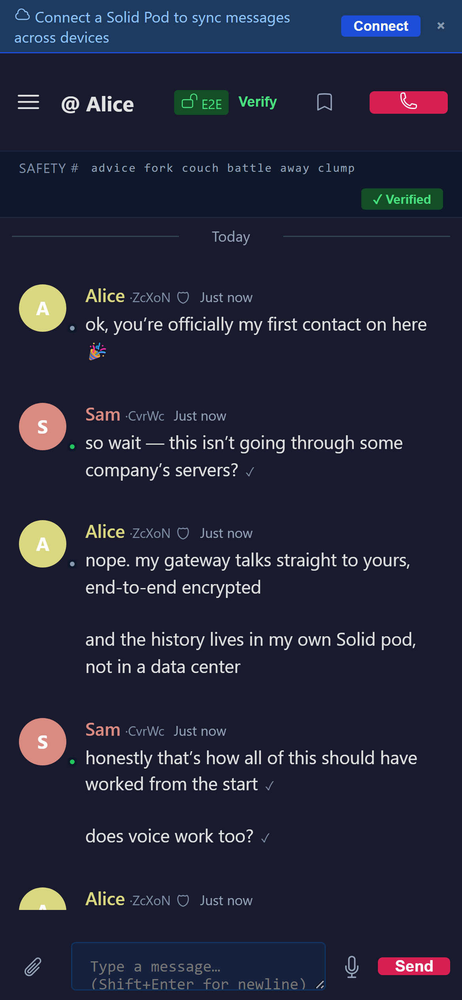
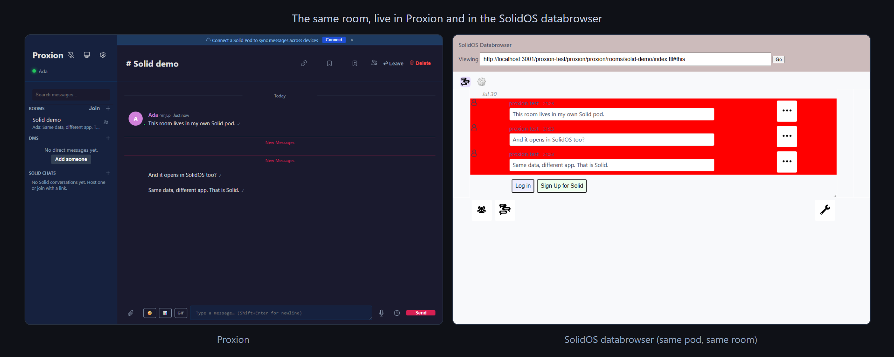

<div align="center">

# Proxion

**Private Nachrichten, die dir wirklich gehören.**

Chat, Sprache und Video mit echter Ende-zu-Ende-Verschlüsselung, bei denen deine Gespräche in
einem Speicher liegen, den du kontrollierst, statt auf den Servern eines Unternehmens. Gebaut
auf dem offenen Standard [Solid](https://solidproject.org). Keine Telefonnummer, keine
Registrierung, kein Unternehmen dazwischen.

**Lies das in deiner Sprache:** [English](README.md) · [日本語](README.ja.md) · [中文（简体）](README.zh-Hans.md) · [中文（繁體）](README.zh-Hant.md) · [한국어](README.ko.md) · Deutsch · [Français](README.fr.md) · [Español](README.es.md) · [Português](README.pt.md) · [Русский](README.ru.md) · [Italiano](README.it.md) · [Polski](README.pl.md) · [Türkçe](README.tr.md) · [Tiếng Việt](README.vi.md) · [Bahasa Indonesia](README.id.md) · [العربية](README.ar.md)

[](https://github.com/cafeTechne/proxion-messenger/actions/workflows/ci.yml)




</div>

## Was ist Proxion?

Proxion ist ein Messenger wie die, die du schon nutzt, mit einem Unterschied, der alles
verändert: deine Daten gehören dir.

Deine Nachrichten, Dateien und dein Anrufverlauf liegen in deinem eigenen **Solid-Pod**, einem
persönlichen Speicherplatz, den du kontrollierst, statt in der App eines Unternehmens
eingeschlossen zu sein. Wähle einen kostenlosen Pod-Anbieter, bring deinen eigenen mit oder
betreibe selbst einen, und wechsle jederzeit. Deine Identität wird auf deinem Gerät erzeugt, es
gibt also kein Konto zum Registrieren und nichts, das abfließen könnte.

Es ist ein echter Alltags-Messenger: Räume und Direktnachrichten, Sprach- und Videoanrufe mit
Bildschirmfreigabe, Dateien, Reaktionen, Antworten und mehr, auf Windows, macOS, Linux und im
Web.

## Proxion holen

**Herunterladen und öffnen.** Es gibt nichts zu konfigurieren und keinen Server zu betreiben.

- **Windows, macOS oder Linux:** hol dir die [Installationsseite](https://cafetechne.github.io/proxion-messenger/)
  oder die [neueste Version](../../releases/latest).
- **macOS mit [Homebrew](https://brew.sh):** `brew install cafeTechne/proxion/proxion`
- **In deinem Browser:** Proxion läuft auch als installierbare Web-App.

Da Proxion nicht von Apple oder Microsoft signiert ist (absichtlich, damit kein Türsteher
zwischen dir und deiner eigenen Software steht), zeigt dein Betriebssystem beim ersten Öffnen
eine einmalige Meldung. Unter Windows wähle *Weitere Informationen und dann Trotzdem
ausführen*; unter macOS *Rechtsklick und dann Öffnen*; Linux zeigt keine Meldung.

## Was du tun kannst

- **Nachrichten und Anrufe.** Gruppenräume und private Eins-zu-eins-Chats, dazu Peer-to-Peer-
  Sprach- und Videoanrufe mit Bildschirmfreigabe.
- **Behalte deinen Verlauf.** Alles liegt in deinem Pod, in einem offenen Format, es gehört
  also dir: zum Aufbewahren, mit anderen Werkzeugen Lesen und Mitnehmen.
- **Wirklich private Gespräche.** Direktnachrichten sind Ende-zu-Ende-verschlüsselt, und du
  kannst mit einer kurzen Sicherheitsphrase, die ihr gemeinsam laut vorlest, bestätigen, dass
  du wirklich mit deinem Kontakt sprichst. Anrufe sind genauso verschlüsselt.
- **Erreiche jeden auf Solid.** Finde und lade Menschen aus dem gesamten Solid-Ökosystem ein,
  nicht nur andere Proxion-Nutzer.
- **Nutze es überall.** Desktop, Browser und Handy, offlinefähig, in sechs Sprachen inklusive
  Arabisch von rechts nach links, und gebaut, um allein mit Screenreader und Tastatur zu
  funktionieren.

<p align="center">
  
</p>

## Teil des Solid-Ökosystems

Proxion ist ein guter Solid-Bürger, kein ummauerter Garten, der Solid nur im Hintergrund
verwendet. Ein Raum, den du erstellst, wird im Standard-Chatformat von Solid geschrieben,
sodass andere Solid-Apps ihn lesen und ihm beitreten können.



- **Öffne einen Proxion-Raum in [SolidOS](https://solidos.org)** und jede Nachricht ist da. Das
  wird in unseren Tests gegen das echte SolidOS geprüft, nicht nur behauptet.
- **Finde und lade Menschen über ihre WebID ein.** Entdecke die Räume, die jemand betreibt,
  oder lege eine Einladung in ihren Solid-Posteingang, den jede Solid-App lesen kann.
- **Sieh neue Nachrichten und Einladungen in Echtzeit,** die dich sogar erreichen, wenn Proxion
  geschlossen ist.
- **Deine Räume überdauern jeden einzelnen Server.** Die Struktur eines Raums liegt in deinem
  Pod, sie kann also allein aus deinem Pod wiederhergestellt werden.

Geteilte Räume sind bewusst offen, damit andere Apps sie lesen können; private
Direktnachrichten sind Ende-zu-Ende-verschlüsselt und absichtlich nur für die Beteiligten
lesbar. Das vollständige Datenformat ist in [docs/POD_DATA_MODEL.md](docs/POD_DATA_MODEL.md)
dokumentiert, das App-für-App-Kompatibilitätsbild in [docs/INTEROP.md](docs/INTEROP.md) und
eine Prüfung Anforderung für Anforderung gegen die Solid-Spezifikationssammlung in
[docs/SOLID_COMPLIANCE.md](docs/SOLID_COMPLIANCE.md).

## Privat durch Design

- **Ende-zu-Ende-verschlüsselte** Direktnachrichten und Anrufe, sodass kein Relay und kein
  Server dazwischen sie lesen kann.
- **Deine Daten in deinem Pod, offen einsehbar.** Es sind dokumentierte, standardkonforme
  Daten, kein verschlossener Block, also kann jede App, die du erlaubst, sie lesen, und du
  kannst jederzeit gehen.
- **Überprüfbar, nicht nur versprochen.** Jeder Download lässt sich bis zu diesem öffentlichen
  Quellcode zurückverfolgen, und tausende automatisierte Tests laufen bei jeder Änderung.

Für die Details, einschließlich des Sicherheitsmodells für Anrufe, des Bedrohungsmodells und
wie man einen Download überprüft, siehe [docs/SECURITY-MODEL.md](docs/SECURITY-MODEL.md),
[docs/CALLS.md](docs/CALLS.md), [SECURITY.md](SECURITY.md) und
[docs/VERIFYING.md](docs/VERIFYING.md).

## Mitmachen

Proxion ist quelloffen, und Beiträge sind wirklich willkommen, von Fehlerberichten bis zu Code.
Fang mit [CONTRIBUTING.md](CONTRIBUTING.md) an. Wenn du aus der Solid-Community kommst und etwas
nicht so zusammenarbeitet, wie du es erwartest, ist das genau die Art von Problem, von der wir
hören wollen.

## Für Entwickler und Selbsthoster

Die meisten sollten einfach den Installer oben nutzen. Um an Proxion zu basteln oder deine
eigene immer laufende Gateway zu betreiben (zum Beispiel, um ein Handy auf deinen Desktop zu
richten):

```bash
pip install -e ./proxion-messenger-core[gateway]
cp .env.example .env   # optionale Pod-Zugangsdaten; leer lassen für rein lokalen Betrieb
python run_gateway.py
# öffne http://localhost:8080
```

Einen nativen Installer bauen:

```bash
pip install pyinstaller
pip install -e ./proxion-messenger-core[gateway]
python build_sidecar.py           # die Gateway für deine Plattform bündeln
cd tauri-app && cargo tauri build # nativer Installer
```

Die Tests ausführen:

```bash
cd proxion-messenger-core && pytest    # Backend
cd web && npm test                     # Frontend
```

**Wie alles zusammenpasst.** Das Frontend (in `web/`) wird von einer kleinen **Gateway** (in
`proxion-messenger-core/`) ausgeliefert, die deine Schlüssel hält, mit deinem Pod spricht und
sich direkt mit den Gateways deiner Kontakte verbindet. Auf dem Desktop steckt die Gateway in
der App und startet mit ihr, du siehst sie also nie und installierst kein Python. Die Gateway
existiert, weil Solid Daten und Identität abdeckt, aber nicht die Live-Zustellung, die Präsenz
oder den Anrufaufbau, dieselbe Rolle, die ein Homeserver für Matrix oder ein SMTP-Server für
E-Mail spielt. Details in [docs/ARCHITECTURE.md](docs/ARCHITECTURE.md) und
[docs/SELF_HOSTING.md](docs/SELF_HOSTING.md).

## Lizenz

[AGPL-3.0](LICENSE). Frei zum Nutzen, Selbsthosten, Forken und Beitragen. Wenn du ein
verändertes Proxion als Dienst für andere betreibst, musst du deine Änderungen veröffentlichen.
Das ist der Sinn: niemand darf daraus wieder ein Silo machen.
