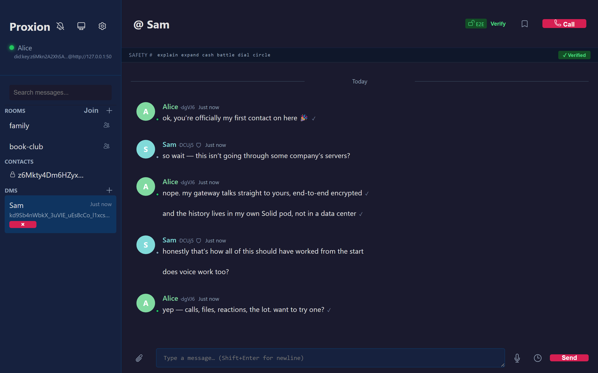
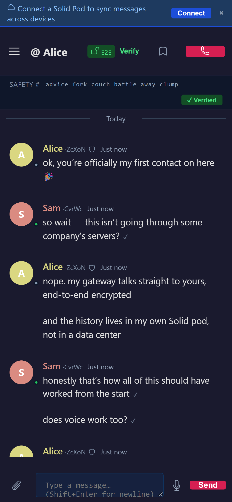

<div align="center">

# Proxion

**The messenger that keeps your data yours.**

End-to-end encrypted messaging and voice, built on the [Solid Protocol](https://solidproject.org).
Your messages live in your own Solid pod, on hardware you control —
no account, no phone number, no company in the middle.

[](https://github.com/cafeTechne/proxion-messenger/actions/workflows/ci.yml)




</div>

## Why Proxion

Every mainstream messenger stores your conversations in someone else's data center, under
someone else's terms. Proxion inverts that:

- **Your data, in your pod** — message history is written to a [Solid](https://solidproject.org)
  pod *you* choose: [Inrupt PodSpaces](https://www.inrupt.com) (free tier),
  [solidcommunity.net](https://solidcommunity.net), or a self-hosted
  Community Solid Server. Proxion speaks the Solid Protocol directly (WebID, DPoP-bound
  tokens) — it's a Solid app, not a silo with an export button. Pod-less local-only mode
  works too.
- **Actually private** — end-to-end encrypted DMs with per-contact safety numbers you can
  verify out loud. Your identity is an Ed25519 key generated on your machine; there is no
  signup, so there is nothing to leak.
- **No lock-in** — open source, open protocol, standard data. Gateways federate
  peer-to-peer by Proxion address, with no central registry to shut down.

## Features



Rooms and DMs · P2P WebRTC voice calls · file attachments and media previews · reactions,
edits, pins, mentions · disappearing and scheduled messages · cross-gateway federation ·
multi-device with encrypted fanout · offline-capable PWA with push · six languages
including RTL Arabic · WCAG 2.2 AA accessible.

## Download

Grab the latest native build for **Windows (x64/ARM64), macOS (Intel/Apple Silicon), or
Linux (x64/ARM64)** from the [install page](https://cafetechne.github.io/proxion-messenger/)
or the [releases page](../../releases/latest).

The executables are intentionally not vendor-signed (no Apple/Microsoft gatekeeping;
updates are verified against Proxion's own signing key), so the OS shows a one-time
caution prompt — on Windows: *More info → Run anyway*; on macOS: *right-click → Open*.
Linux has no prompt.

## Run from source

```bash
pip install -e ./proxion-messenger-core[gateway]
cp .env.example .env   # optional: pod credentials; leave blank for local-only
python run_gateway.py
# open http://localhost:8080
```

## Build a native executable

```bash
pip install pyinstaller
pip install -e ./proxion-messenger-core[gateway]
python build_sidecar.py           # PyInstaller sidecar for your platform
cd tauri-app && cargo tauri build # native installer
```

## Architecture

- `web/` — frontend (vanilla JS, no framework), served by the gateway
- `proxion-messenger-core/` — Python backend library + WebSocket/HTTP gateway
- `tauri-app/` — Rust/Tauri desktop wrapper bundling the gateway as a sidecar
- `landing/` — the GitHub Pages install page

Each user runs their own **gateway** — the app and the server are the same download. The
gateway holds your identity keys, talks Solid to your pod, and federates directly with
your contacts' gateways. See [docs/ARCHITECTURE.md](docs/ARCHITECTURE.md) and
[docs/SELF_HOSTING.md](docs/SELF_HOSTING.md).

## Testing

```bash
cd proxion-messenger-core && pytest    # backend
cd web && npm test                     # frontend units
```

Browser-level gates live in `web/` (`smoke:a11y`, `smoke:keyboard`, `smoke:pseudo`,
`smoke:federation`, …) — see [TESTING.md](TESTING.md).

## License

[AGPL-3.0](LICENSE) — free to use, self-host, fork, and contribute to. If you run a
modified Proxion as a service for others, you must publish your changes. That's the
point: nobody gets to turn this back into a silo.
